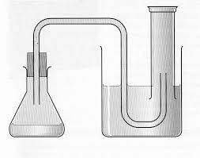

```{r include=FALSE}
# library(tidyverse)
library(ggplot2)
library(dplyr)
library(tidyr)
library(pwr)
library(zoo)
library(knitr)
library(ggpubr)
library(here)
library(lubridate)
```

# Introductie
Bakkersgist, of Saccharomyces cerevisiae, is een essentieel micro-organisme in de voedselindustrie, met name in de bakkerijsector. Het wordt veelvuldig gebruikt vanwege zijn vermogen om suikers om te zetten in kooldioxide (CO2) en ethanol via het proces van fermentatie. Deze CO2-productie is cruciaal voor het rijzen van deeg, wat resulteert in luchtig brood en andere gebakken producten.  

Hoewel het algemene fermentatieproces van bakkersgist goed gedocumenteerd is, is er minder bekend over hoe specifieke variabelen, zoals suiker- en zoutconcentraties, de CO2-productie beïnvloeden. Aangezien zowel suiker als zout belangrijke ingrediënten zijn in de meeste deegrecepten, is het essentieel om te begrijpen hoe variaties in hun concentraties de efficiëntie van het fermentatieproces beïnvloeden.  

Hoe beïnvloeden verschillende suikerconcentraties de CO2-productie van bakkersgist?  
Wat is de impact van zoutconcentraties op de CO2-productie van bakkersgist?  
Zijn er optimale concentraties van suiker en zout die de CO2-productie maximaliseren?  

De opzet van dit onderzoek is geïnspireerd door het onderzoek van [@Jerry2017], waarin de CO2-productie door bakkersgist bij verschillende suikerconcentraties werd bestudeerd. Het doel van dat onderzoek was om te evalueren of bakkersgist met variërende suikerconcentraties als een alternatief CO2-productiemedium kan dienen in de BG-Sentinel® muggenval.

Het doel van dit onderzoek is om de optimale omstandigheden te identificeren waarin bakkersgist de meeste CO2 produceert, met een specifieke focus op de concentraties van suiker en zout. Door een beter begrip te krijgen van deze relaties, kunnen bakkerijen en andere voedselproducenten hun productieprocessen verbeteren, resulterend in beter gerezen en kwalitatief hoogwaardigere producten. Bovendien kan deze kennis bijdragen aan het optimaliseren van recepten en het verminderen van kosten door efficiënter gebruik van ingrediënten.  

In de volgende secties van dit rapport zullen we eerst een overzicht geven van de bestaande literatuur over de rol van suiker en zout in het fermentatieproces. Vervolgens beschrijven we de methodologie die we hebben gebruikt om de CO2-productie van bakkersgist onder verschillende omstandigheden te meten. De resultaten van onze experimenten worden gepresenteerd en geanalyseerd, waarna we deze bevindingen bespreken in de context van de huidige wetenschappelijke kennis. Ten slotte zullen we conclusies trekken en aanbevelingen doen voor toekomstig onderzoek en praktische toepassingen.

# Materialen en Methoden
Alle informatie is in een github repo opgeslagen. Die repo is [$\text{\underline{hier}}$](https://github.com/Akoens/ProjectWetenschappelijkeCyclus) te vinden.

## Materialen
Alle stoffen met houdbaarheidsdatum werden op de dag van het experiment gekocht bij de Jumbo. De bakkersgist is van het Jumbo huismerk, met het batchnummer L916579 3. De suiker is kristalsuiker van Van Gilse, met het batchnummer L3416520 11. Het zout is fijn zeezout van La Baleine, met het batchnummer LA 240231144. Als water was kraanwater gebruikt.
Wij hebben voor elke individuele proef een maatcilinder van 250 ml, een luchtdichte pot met een goed afsluitende deksel, een 30 cm lang buisje en een klem. In totaal zijn 12 proeven uitgevoerd voor dit experiment. Hiernaast is ook 1 waterbad gebruikt, met de afmetingen 35 x 70 x 15 cm, 4 waterbakken, met de afmetingen 20 x 20 x 15 cm en een rol duct tape.

## Uitvoering

Het waterbad werd met kraanwater tot het 10 cm hoog stond en de verwarming van het waterbad op 30 °C gezet. Daarnaast werden ook de waterbakken gevuld tot het water tot 10±1.5 cm hoog stond. Hierna werden de maatcilinders vrijwel helemaal met water gevuld en werden ze op de kop neergezet in de waterbakken, zodat de waardes afgelezen konden worden en er te minste 2 cm ruimte tussen de bodem van de bak en het uiteinde van de maatcilinder zit. Als de waardes niet leesbaar waren of als de maatcilinder meer dan 60 ml aflas, werd de maatcilinder uit de bak gehaald en werd de stap herhaald. Als de stap goed was uitgevoerd werd het waterpeil afgelezen en genoteerd als de nulmeting. In de deksels van de potten werden gaten gemaakt en de buisjes werden vervolgens door de gaten gestopt. De mogelijke overige gaten werden afgeplakt met duct tape. Uiteindelijk moet het er ongeveer zo uit zien:



Toen de opzet was voltooid konden de proeven worden uitgevoerd. Elke proef had 7 gram gist en een totaal gewicht van 200 g, met als variabele concentratie suiker en zout.

Er werden 3 verschillende concentraties van suiker en zout getest, in duplo(aangegeven met een d in het ID).

De concentratie werd aangevuld met water tot het in totaal 200 g was. De concentraties van de verschillende proeven waren:

```{r echo=FALSE}
concentraties <- read.csv(file = "../raw_data/data_gist_werkelijke_concentraties.csv")
viz_conc <- tibble(experiment = concentraties$experiment_id,
                       suiker = concentraties$suiker,
                       zout = concentraties$zout)
kable(
    list(viz_conc), caption = "Suiker- en zoutconcentraties in g/L", col.names = c("Experiment", "Suiker g/L", "Zout g/L")
    )
```
```{r echo=FALSE}
viz_conc$suiker <- (concentraties$suiker/200) * 100
viz_conc$zout <- (concentraties$zout/200) * 100
kable(list(viz_conc), caption = "Suiker- en zoutconcentraties in procenten", col.names = c("Experiment", "Suiker %", "Zout %"))
```

Deze concentraties werden in verschillende potten gedaan en toen alles was opgelost, kon het deksel op de pot en werd de pot in het waterbad gezet. Het buisje werd daarna tot onder in de maatcilinder geleidt, zodat er een waterslot ontstond. Toen alle proeven in het waterbad stonden werd er om de 15 minuten het waterpeil van de maatcilinders afgemeten. Als het waterpeil niet leesbaar was door overproductie van gas, werd het maximale aantal(250ml) opgeschreven en moest de maatcilinder opnieuw worden gevuld en werd een nieuwe nulmeting genoteerd naast de meting.

## Gebruikte software en bibliotheken

Voor de visualisatie en de tests worden verschillende tools gebruikt.

tidyverse, waarvan deze library's worden gebruikt: ggplot2 ([$\text{\underline{versie 3.5.1}}$](https://cran.r-project.org/web/packages/ggplot2/index.html)), die gebruikt wordt voor het visualiseren van data door middel van plotten; dplyr ([$\text{\underline{versie 1.1.4}}$](https://cran.r-project.org/web/packages/dplyr/index.html)), voor het aanpassen van data; en tidyr ([$\text{\underline{versie 1.3.1}}$](https://cran.r-project.org/web/packages/tidyr/index.html)), om data op een 'tidy' manier in de code te krijgen. 
Verder wordt de 'pwr' library gebruikt, voor de power tests, waarvan de 1-weg-anova en t test op versie 1.3-0 worden toegepast en de 'zoo' library om lineaire interpolatie toe te kunnen passen. Deze wordt gebruikt in [$\text{\underline{versie 1.3.0}}$](https://cran.r-project.org/web/packages/pwr/index.html).

## Gebruikte methodes

De pairwise t test wordt gebruikt om aan te tonen of er significante verschillen zitten tussen de verschillende concentraties van suiker en zout.

De power analise is om te zien of er genoeg proeven zijn om iets te kunnen bewijzen. Een vals positief heeft geen significant verschil op de conclusie in vergelijking met een vals negatief. Daarom is besloten om de resultaten te accepteren als power groter is dan de basis van 80%.

Cohens f wordt gebruikt om zeker te zijn dat als we een significant verschil waarnemen dat verschil ook relevant is.

De one-way-anova wordt twee keer gebruikt, omdat er op twee factoren worden getest(suiker en zout), maar er te weinig proeven waren om een two-way-anova te kunnen gebruiken. Het wordt gebruikt om te kijken of de groepen vergelijkbaar of precies hetzelfde zijn, maar de 1-weg-anova heeft wel wat aannames, het gaat er bijvoorbeeld vanuit dat de data normaal verdeeld zijn.
Dus als uit de histogram blijkt dat de data niet normaal verdeeld zijn, dan wordt de Kruskal Wallis test naast de 1-weg-anova gebruikt voor een beter idee of de groepen vergelijkbaar zijn.

## Imputatie
Tijdens dit experiment zijn er negatieve waardes gemeten. Een negatieve gasproductie is met onze opzet niet mogenlijk concluderen wij hieruit dat dit een meetfout is. Er is gekozen om imputatie toe te passen in de vorm van interpolatie op advies van Emil Appol. Dit is bij het suiker experiment 11 keer toegepast en bij zout 8 keer.  
Ook hebben we de productie metingen met een waarde van 0 veranderd naar 0.00000001, zodat deze metingen gebruikt kunnen in een logaritme functie. Hierdoor kunnen we deze waardes gebruiken zonder dat het de resultaten significant beïnvloed. Er is hier voor gekozen vanwege het sterke vermoeden dat de data geen normaal verdeling heeft en op basis hiervan hebben we een Shapiro-Wilk toets uitgevoerd om de normaliteit te bepalen. 
Naast de Shapiro-Wilk toests hebben we ook een pairwise T test uitgevoerd om te onderzoek of er correlaties zijn tussen de verschillende experimentgroepen. Bijde testen zijn uitgevoerd in Rstudio


# Resultaten
Met dit experiment willen wij onderzoeken of suiker en zout invloed hebben op de gasproductie van gist, waarvan wij aannemen dat dit CO2 is. Hiervoor hebben wij een experiment uitgevoerd zoals beschreven bij materialen en methode met de concentraties in tabel 4 hierbeneden. Verder staan hieronder de belangrijkste resultaten benoemd.

```{r experimenten, echo=FALSE, tab.cap ="Tabel voor de hoeveelheid gram per stof per experiment. (S = Suikergroep, Z = Zoutgroep)"}

totale_massa <- 200

massa_water <- 200
massa_gist <- 7

percentages_suiker <- c(0, 3, 6)
percentage_zout_bij_suiker <- 0.5
len_suiker = length(percentages_suiker)

percentages_zout <- c(0, 0.5, 1)
percentage_suiker_bij_zout <- 3
len_zout = length(percentages_zout)

# Import een functie om percentage naar massa te berekenen 
source(paste(here(), "/analysis/scripts/utilities.R", sep = ""), local = T)

# Concentraties als percentage van totale massa
massa_suiker <- perc_to_mass(percentages_suiker, totale_massa)
massa_zout_bij_suiker = perc_to_mass(percentage_zout_bij_suiker, totale_massa)

massa_zout <- perc_to_mass(percentages_zout, totale_massa)
massa_suiker_bij_zout = perc_to_mass(percentage_suiker_bij_zout, totale_massa)

## Suiker
vaste_massa <- massa_suiker + (massa_zout_bij_suiker + massa_gist)

df_suiker = data.frame(
    Experiment = paste("S", 1:len_suiker, sep=""),
    Suiker = massa_suiker,
    Gist = rep(massa_gist, len_suiker),
    Water = (rep(totale_massa, len_suiker) - vaste_massa),
    Zout = rep(
        massa_zout_bij_suiker,
        len_suiker
    )
)
df_suiker$totaal <- rowSums(df_suiker[-1])
#print(df)
#kable(df)

## Zout
vaste_massa <- massa_zout + (massa_suiker_bij_zout + massa_gist)

df_zout = data.frame(
    Experiment = paste("Z", 1:len_zout, sep=""),
    Suiker = rep(massa_suiker_bij_zout, len_zout),
    Gist = rep(massa_gist, len_zout),
    Water = (rep(totale_massa, len_zout) - vaste_massa),
    Zout = massa_zout
)
df_zout$totaal <- rowSums(df_zout[-1])
#print(df)
kable(list(df_suiker,df_zout))
```


## Data verkenning
Tijdens de uitvoering van het experiment zagen we dat de duplo experimenten niet gelijk waren aan originele experiment zoals te zien is in de lijngrafieken hieronder(figuur 2). Hieruit kwam een vermoeden dat de data niet normaal verdeeld zou zijn. Ook zijn er meetfouten gemaakt tijdens de uitvoering, hiervoor hebben wij een imputatie strategie uitgevoerd zoals beschreven bij matriaal en methode.  

```{r productielijnen, echo=FALSE, fig.cap="Gas productie van verschillende suiker en zout consentraties naast elkaar. (S = Suiker, Z = Zout, d = Duplo, Getal = Concentratie)"}

# Ruwe data van suiker
path <- paste(here(), "/raw_data/data_gist_suiker.csv", sep="")
data_suiker <- read.csv(path)

# Ruwe data van zout halen
path <- paste(here(), "/raw_data/data_gist_zout.csv", sep="")
data_zout <- read.csv(path)

# Data type correctie
data_zout$cumulatieve_productie <- as.double(data_zout$cumulatieve_productie)
data_zout$relatieve_productie <- as.double(data_zout$relatieve_productie)

# Tijd correctie en omzetting naar verstreken uren
data_suiker$datetime <- with(data_suiker, ymd(data_suiker$datum) + hm(data_suiker$tijd))
data_zout$datetime <- with(data_zout, ymd(data_zout$datum) + hm(data_zout$tijd))

# Bereken verstreken uren voor suiker
data_suiker <- data_suiker %>%
  group_by(experiment_id) %>%
  mutate(elapsed_hours = as.numeric(difftime(datetime, min(datetime), units = "hours")))

# Bereken verstreken uren voor zout
data_zout <- data_zout %>%
  group_by(experiment_id) %>%
  mutate(elapsed_hours = as.numeric(difftime(datetime, min(datetime), units = "hours")))

# Suiker lijn grafiek
g <- ggplot(data_suiker, aes(x=elapsed_hours, y=cumulatieve_productie, color=experiment_id, shape=experiment_id, linetype=experiment_id)) + 
  geom_line(linewidth=0.75) #+ geom_point()

g <- g + labs(x="Tijd (h)", y="Productie (ml)", title = "Suiker", color = "Experiment", linetype = "Experiment", shape = "Experiment")
suiker_lijn <- g

# Zout lijn grafiek
g <- ggplot(data_zout, aes(x=elapsed_hours, y=cumulatieve_productie, color=experiment_id, shape=experiment_id, linetype=experiment_id)) + 
  geom_line(linewidth=0.75) #+ geom_point()

g <- g + labs(x="Tijd (h)", y="Productie (ml)", title = "Zout", color = "Experiment", linetype = "Experiment", shape = "Experiment")
zout_lijn <- g

lijn_arange <- ggarrange(suiker_lijn, zout_lijn, nrow=2, font.label=list(size=12))
print(lijn_arange)
```


De CO2 productie gemiddelden van het originele experiment en de duplo versie hiervan lopen verder uit elkaar dan verwacht(tabel 4). 

```{r inladen, echo=FALSE}
suiker_data <- read.csv("../raw_data/data_gist_suiker.csv")
zout_data <- read.csv("../raw_data/data_gist_zout.csv")
# Mutatie suiker
# uitleg hiervan staat in logboek ivar
# suiker
suiker_data <- suiker_data %>% mutate(relatieve_productie = if_else(relatieve_productie < 0, NA, relatieve_productie))
suiker_data <- suiker_data %>% mutate(relatieve_productie = if_else(relatieve_productie == 0, 0.000001, relatieve_productie))
suiker_data <- suiker_data %>% mutate(relatieve_productie = (zoo::na.approx(relatieve_productie)))
# zout
zout_data <- zout_data %>% mutate(relatieve_productie = if_else(relatieve_productie < 0, NA, relatieve_productie))
zout_data <- zout_data %>% mutate(relatieve_productie = if_else(relatieve_productie == 0, 0.000001, relatieve_productie))
zout_data <- zout_data %>% mutate(relatieve_productie = (zoo::na.approx(relatieve_productie)))
```


```{r echo=FALSE}
suiker_gem_tibble <- suiker_data %>% group_by(experiment_id) %>% 
    summarise(gemmidelde_productie = mean(relatieve_productie))

zout_gem_tibble <- zout_data %>% group_by(experiment_id) %>%
    summarise(gemmidelde_productie = mean(relatieve_productie))

(kable(list(suiker_gem_tibble, zout_gem_tibble),col.names = c("Experiment", "Gemiddelde Productie (ml)"), digits = 2, caption = "Gemiddelde gas productie in ml van de verschillende experimenten. (S=Suiker, Z=Zout, d= Duplo, getal=experiment concentratie.)"))

```
Deze bovenstaande tabel en grafiek duiden aan dat er een fout was in de opstelling van dit experiment vanwege het verschil in origineel en duplo experiment(tabel 4, figuur 2).


## Normaal verdeling

```{r histogrammen, echo=FALSE, fig.cap = "Histogrammen over de gasproductie hoeveelheden en hoe vaak ze voorkomen van gist in gas per ml. De linker grafiek is voor de gist experimenten met variërende suiker concentraties en de rechter grafiek is voor de experimenten met variërende zout concentraties. Beide grafieken bestaat uit 66 metingen "}
suiker_data$Productie = suiker_data$relatieve_productie

suiker_hist <- ggplot(data = suiker_data, 
       mapping = aes(x = Productie)) +
    geom_histogram(binwidth = 10, colour = "black", fill="saddlebrown") + 
    labs(x="Productie in ml",y="Frequentie")+
    theme_minimal()

zout_hist <- ggplot(data = zout_data,
       mapping = aes(x = relatieve_productie)) +
    geom_histogram(binwidth = 10, colour = "black", fill="saddlebrown") +
    labs(x="Productie in ml",y="Frequentie")+
    theme_minimal()

box_figure <- ggarrange(suiker_hist,zout_hist,
                        labels = c("Suiker", "Zout"), 
                        hjust = 0,vjust = 1,
                        font.label = list(size = 12))

box_figure

```

Uit de Shapiro wilks test komen de volgende resultaten. Voor het suiker experiment een p waarde van 1.902e-12 uit en voor het zout experiment een p waarde van 5.402e-09. 

Beide getallen zijn kleiner dan 0.05 dus kan er geconcludeerd worden dat data uit het experiment niet betrouwbaar is.

```{r echo=FALSE, include=FALSE}
shapiro.test(suiker_data$relatieve_productie)
shapiro.test(zout_data$relatieve_productie)
```

Zoals te zien aan de histogrammen(figuur 3) hierboven van beide experiment groepen weergeeft dit de resultaten van de shapiro-wilks test duidelijk weer. Aan de hand van deze informatie hebben wij er voor gekozen om een Anova toets uit te voeren met de logaritmische waardes van de gasproductie. De Anova zelf is voor het analyseren of de verschillende groepen significant van elkaar verschillen, en de logaritmische waardes om de resultaten van toets statistisch en wiskundig te verantwoorden. 
Hiernaast voeren wij ook een Kruskal Wallis toets uit aanvullend op de Anova. Dit is omdat deze toets meestal dient als vervanging van de Anova als de data niet normaal verdeeld is. 


## Pairwise T test 

De pairwise T test hebben wij uitgevoerd om te kijken of er significante correlaties zijn tussen de onderlinge test-groepen. Hieruit is gekomen dat bij het suiker experiment groep 3 significant verschilt van groep 1 en 2, en bij zout is er alleen een significant verschil tussen groep 2 en 3. dit is geconcludeerd uit (tabel 5) met P waardes lager dan 0.05 

```{r echo=FALSE}
suiker_matrix = matrix(c(0.190, 9.5e-05, NaN, 0.006), ncol = 2)
colnames(suiker_matrix) = c("Es1", "Es2")
rownames(suiker_matrix) = c("Es2", "Es3")
#kable(suiker_matrix)
zout_matrix = matrix(c(0.442, 0.2, NaN, 0.043), ncol = 2)
colnames(zout_matrix) = c("Ez1", "Ez2")
rownames(zout_matrix) = c("Ez2", "Ez3")
kable(list(suiker_matrix, zout_matrix), caption = "Resultaat Pair wise T test. De waardes in de tabel zijn P waardes. (E = Experiment, s = suiker, z = zout)")
```


## Anova en Kruskal
Om onze hypothese te bewijzen hebben er voor gekozen om een Anova toets uit te voeren. Dit zou statistisch weergeven of verschillende suiker en zout concentraties effect hebben op de Co2 productie van gist. 
Omdat onze opzet niet een 2 weg anova toeliet hebben wij er voor gekozen om twee keer een 1 weg anova toe te passen. Dit heeft als nadeel dat wij niet het effect van suiker en zout onderling kunnen meten, maar wel of er een significant verschil is in productie.

Uit de Anova toets met logaritmische waardes kwamen de volgende P waardes.

De P waarde van suiker 0.000169 

De P waarde van zout 0.309

Uit deze P waarden kun je opmaken dat suiker een significante invloed heeft op de CO2 productie van gist en zout niet.

Uit de Kruskal Wallis test kwamen de volgende P waarden.

De P waarde van suiker 9.428e-05

De P waarde van Zout 0.09032

Hieruit kun je de zelfde conclusies trekken als bij de Anova toets met logaritmische waarden. Wat hieraan wel opvalt is dat de P waardes van beide testen erg uit elkaar liggen.


## Effect sterkte van Anova resultaten
Aan de hand van de resultaten van de anova hebben wij ervoor gekozen om een Cohens F sterkte analyse uit te voeren om te bepalen hoe sterk het gemeten resultaat is.
De F waarde van suiker is 0.563382
De F waarde van zout is 0.1948619
Aan de hand van de benchmark waarden van Cohens F kunnen we zeggen dat suiker een sterk effect heeft en zout een zwak effect heeft op de gasproductie van gist.

## Power analyse van Anova resultaten
De power analyse hebben wij gedaan om te kijken hoe betrouwbaar onze resultaten zijn. 
Bij Suiker komt er een power waarde uit van 0.7923
Bij zout komt er een power waarde uit van 0.1448
Deze waardes vertellen ons dat wij met onze resultaten van suiker met zekerheid kunnen zeggen maar dat van zout niet. Dit is omdat suiker vlak bij de standaard power-waarde van 0.80 zit en de waarde van zout hier ver vandaan zit.


# Discussie en Conclusies
## Validiteit
De experimenten lieten zien dat de gasproductie variërend was afhankelijk van de suiker- en zoutconcentraties. Bij de suikerexperimenten vertoonde de gasproductie significante verschillen tussen de duplo's: S1 had een verschil van 0.91 ml, S2 van 40 ml en S3 van 90 ml. Bij de zoutexperimenten was dit verschil kleiner: Z1 en Z2 toonden beide een verschil van 23 ml, terwijl Z3 een verschil van 15 ml vertoonde. (Zie Tabel 4)

De hoogste gasproductie werd waargenomen bij de hoogste suikerconcentratie (Sd3), met een gemiddelde productie van 107 ml per 15 minuten of 428 ml per uur. Deze waarden zijn aanzienlijk hoger dan verwacht; eerder onderzoek door [@Jerry2017] suggereerde een maximale productie van 25 ml CO2 per uur. Dit onverwacht hoge resultaat leidde tot complicaties tijdens de uitvoering van het experiment, aangezien de gebruikte maatcilinders niet voldoende capaciteit hadden om de geproduceerde hoeveelheid gas op te vangen. Een andere mogelijke verklaring voor de hoge gemeten gasproductie is een mogelijk lek in het waterslot, waardoor lucht in de maatcilinder terecht kon komen. Dit soort technische problemen benadrukt de noodzaak van nauwkeurige en betrouwbare meetapparatuur en zorgvuldigere uitvoering om betrouwbare resultaten te waarborgen.

## Interpretatie van de Resultaten
Het onderzoek toonde een significant verschil aan in de CO2-productie van bakkersgist bij verschillende suikerconcentraties, terwijl er geen significant verschil werd waargenomen bij de verschillende zoutconcentraties. Dit suggereert dat suiker een belangrijker factor is in de gasproductie van gist dan zout.

## Beperkingen
Het onderzoek kende enkele beperkingen. Vanwege beperkte ruimte en materialen konden slechts zes experimenten worden uitgevoerd, wat mogelijk onvoldoende was om significante effecten van zowel suiker als zout op de gasproductie vast te stellen. Daarnaast was de tijd beperkt, waardoor het experiment slechts minder dan vier uur duurde in plaats van de gewenste zeven uur. Deze beperkingen kunnen de robuustheid en betrouwbaarheid van de resultaten hebben beïnvloed.

## Implicaties
Dit onderzoek biedt een basis voor het bepalen van de optimale suiker- en zoutconcentraties voor gistactiviteit. Deze informatie is cruciaal voor de bakkerij- en alcoholindustrie, aangezien een beter begrip van deze factoren kan leiden tot efficiëntere productieprocessen.

## Aanbevelingen voor Vervolgonderzoek
Voor toekomstig onderzoek is het aan te raden om meer combinaties van suiker- en zoutconcentraties te testen, zodat een 2-weg ANOVA kan worden uitgevoerd. Dit zou een duidelijker beeld geven van de interactie tussen deze factoren en hun gezamenlijke invloed op de gasproductie. Daarnaast kan de experimentele opzet verbeterd worden door gasproductie nauwkeuriger af te meten en meer replicaten te gebruiken. Het zou ook nuttig zijn om een robuustere opstelling te ontwerpen, die lekken of fouten snel kan identificeren en corrigeren.

```{r wordcount, message=FALSE, echo=FALSE,include=FALSE}
#install.packages("devtools")
#devtools::install_github("benmarwick/wordcountaddin", type = "source", dependencies = TRUE)
wordcountaddin:::text_stats()
# wordcount circa 2200
# reading 10 min circa
```

# Referenties